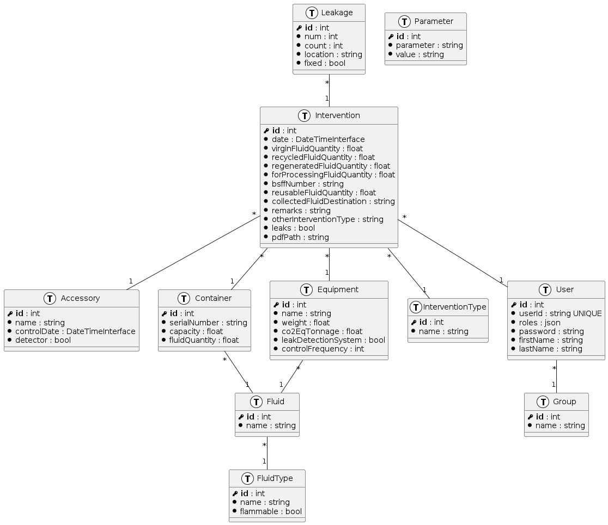

# Symplant
Make a class diagram from entities found in a Symfony 5.4+ project.

## Dependencies
bash, plantuml, feh

# Install

`$ cp src/symplant.sh ~/.local/bin/symplant`

## Usage
*  `$ symplant path/to/symfony/project`

*  `path/to/symfony/project $ symplant`

## Example

## Uninstall

`$ rm ~/.local/bin/symplant`
